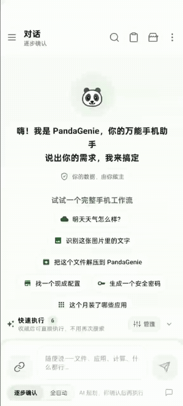

# PandaGenie Source

中文优先说明 | [English README](README_EN.md) | [官网](https://cf.pandagenie.ai) | [任务市场](https://cf.pandagenie.ai/marketplace) | [Discord](https://discord.gg/Cfc7pjrjt2)

PandaGenie 是一个开源免费的 Android 模块助手。它把自然语言、AI 规划、可热加载 Android 模块和端侧权限控制组合在一起，让用户可以用一句话完成手机上的日常任务，也让开发者可以把自己的能力封装成模块或可交互应用，接入到 PandaGenie 的任务执行链路里。

这个仓库是 PandaGenie 的 Source 主仓库，包含 Android App、官方模块源码、模块开发工具链、文档和发布配置。它和 SDK、模块模板、SDK Provider 示例工程共同组成 PandaGenie 开发生态。

## 项目说明

PandaGenie 的核心目标不是再做一个聊天机器人，而是让自然语言真正落到手机操作上：

1. 用户用自然语言提出需求，比如“把图片压缩到更小”“明天早上提醒我看天气”“把 ZIP 解压到 PandaGenie 目录”。
2. App 先从任务市场匹配已有任务，匹配不到时再让 LLM 生成任务计划。
3. 任务计划会被转换成模块调用链，每一步都带有模块、接口、参数、权限和执行说明。
4. App 负责权限确认、变量替换、文件路径保护、执行追踪、结果展示和错误提示。
5. 模块只负责自己的能力实现，例如 OCR、文件管理、天气、网络检查、图片处理、设备信息等。

这套结构让 PandaGenie 同时具备三种能力：

- 用户侧：一句话创建和执行手机任务。
- 模块侧：开发者可以独立扩展 Android 功能模块。
- 应用互联侧：通过 PandaGenieSDK，让其他 App 暴露可调用能力，被 AI 助手发现和调用。

## 生态项目

| 项目 | 用途 | 地址 |
| --- | --- | --- |
| PandaGenieSource | Android App 与官方模块源码，本仓库 | https://github.com/Rorschach123/PandaGenieSource |
| PandaGenie-Module-Template | 模块开发模板，适合开发者快速创建新模块 | https://github.com/Rorschach123/PandaGenie-Module-Template |
| PandaGenieSDK | Android 应用互联 SDK，供 AI 助手和能力应用接入 | https://github.com/Rorschach123/PandaGenieSDK |
| PandaGenieSDK-Provider-Template | SDK Provider 示例工程，演示被调用应用如何暴露能力 | https://github.com/Rorschach123/PandaGenieSDK-Provider-Template |
| 官网与任务市场 | 下载 APK、浏览任务和模块、提交模块和 SDK 应用 | https://cf.pandagenie.ai |

## 快速体验

- 最新 APK： [PandaGenie v1.0.37](https://github.com/Rorschach123/PandaGenieSource/releases/download/20260519/PandaGenie-v1.0.37.apk)
- 官网下载： [https://cf.pandagenie.ai](https://cf.pandagenie.ai)
- 版本号：`1.0.37`
- versionCode：`10037`
- 最近更新：`2026-05-19`

安装后可以直接尝试：

- “明天天气怎么样？”
- “识别这张图片里的文字”
- “把这个 ZIP 文件解压到 PandaGenie 目录下”
- “生成一个安全密码”
- “打开抖音”
- “帮我做一次手机空间体检，不直接删除”



## PandaGenie 怎么工作

PandaGenie 的执行链路可以理解为一条可审计的手机任务流水线：

```text
用户输入
  -> 安全与权限检查
  -> 任务市场匹配
  -> LLM 生成或补全任务
  -> 变量与附件解析
  -> 权限检查和用户确认
  -> 模块执行
  -> 结果渲染、复制、打开、保存
  -> 执行追踪和历史记录
```

任务可以来自三类入口：

- 现成任务：来自任务市场，可收藏、快速执行、设置为管家任务。
- 即时任务：用户临时输入，由 LLM 生成模块调用链。
- 管家任务：按时间、网络、电量、事件等条件自动触发，执行结果进入“管家”对话。

模块执行过程中，App 会统一处理：

- 动态变量，例如 `${input_file_1}`、`${input_files}`、历史步骤输出。
- 文件路径隐私，分享任务时不会把本机真实路径带出去。
- 权限弹窗，模块声明需要的权限，App 统一确认和授权。
- 结果展示，路径、链接、图片、表格、长文本等会提供复制、打开、保存、查看详情等操作。
- 执行追踪，把每一步的输入、输出、权限和耗时展示给用户。

## 当前能力

截至 `2026-05-19`，官方模块包含约 53 个模块、337 个 API，覆盖以下方向：

| 分类 | 代表模块 | 能力示例 |
| --- | --- | --- |
| 文件与文档 | `filemanager`, `file_stats`, `archive`, `document_tools`, `long_image_generator` | 复制、移动、删除、解压、文档解析、文件统计、长图生成 |
| 图片与识别 | `image_tools`, `ocr`, `qrcode`, `color_picker` | 图片压缩、格式转换、OCR、二维码生成和识别、取色、相册分析、相似照片分组、低质量照片复核 |
| 系统与设备 | `device_info`, `device_controls`, `battery`, `network_tools`, `system_cleaner` | 设备信息、电池信息、亮度音量、网络检测、空间体检 |
| 应用与自动化 | `app_control`, `app_manager`, `contacts`, `clipboard` | 打开应用、应用列表、主题切换、联系人、剪贴板 |
| 生活效率 | `weather`, `reminder`, `notes`, `password_gen`, `location_helper` | 天气、提醒、便签、安全密码、当前位置和经纬度反查 |
| 文本与 AI | `text_tools`, `translator`, `link_parser`, `hello_world` | 文本处理、翻译、链接解析、示例模块 |
| 游戏与页面 | `tetris_game`, `snake_game`, `sudoku_game`, `gomoku_game`, `fullscreen_countdown` | 游戏页面、全屏倒计时、可打开页面模块 |
| 安全与开发 | `signature_checker`, `claw_*` | 签名检查、开发调试、示例能力 |

部分模块可以声明 `AI 模型` 权限，通过 App 提供的统一 LLM 接口完成模块内部的总结、翻译、分析或结构化输出。PandaGenie Official 模型调用会计入体验次数和 token 用量，第三方模型配置则走用户自己的模型接口。

## 1.0.37 更新重点

- 图片工具升级到 `1.19`：新增相册结构分析、相似照片分组复核、低质量照片候选识别，并由 App 提供统一选择、预览和删除确认界面。
- 天气助手升级到 `1.6`：穿衣、带伞、出行、温差等问题会把核心建议放在主输出顶部。
- 新增 `location_helper` 位置助手模块：支持获取当前国家、城市、地址、经纬度、海拔、定位精度和按坐标反查地址。
- 模块索引刷新到 53 个官方模块 / 337 个 API，并同步 GitHub Release、官网 APK 下载和 Cloudflare 版本数据库。

## 记忆与隐私

`v1.0.35` 引入了端侧记忆能力：

- 支持全局记忆、私有记忆和关闭记忆三种模式。
- 记忆默认保存在本机 `app_memory/memories.json`。
- 每次请求最多检索 8 条相关记忆。
- 敏感值会优先保存到保险箱变量，不直接写入对话。
- 默认保留 30 天，最多保留 500 条。

所有隐私相关能力都遵循一个原则：App 提供统一能力和权限控制，模块只声明需求，不自行绕过 App 做敏感访问。

## 模块开发

如果你想开发自己的模块，推荐从模板项目开始：

- 模块模板： [PandaGenie-Module-Template](https://github.com/Rorschach123/PandaGenie-Module-Template)
- 模块提交： [https://cf.pandagenie.ai/sign](https://cf.pandagenie.ai/sign)
- 模块市场： [https://cf.pandagenie.ai/marketplace](https://cf.pandagenie.ai/marketplace)

模块通常包含：

```text
module.json          # 模块元信息、权限、API 定义、页面入口
src/main/...         # Android/Kotlin/Java 代码
assets/html/...      # 可选 HTML 页面或交互界面
README.md            # 模块说明
```

模块需要明确声明：

- 模块名称、版本、开发者、签名信息。
- 提供哪些 API。
- 每个 API 的参数、返回结构和权限。
- 是否需要打开页面、访问文件、联网、调用 AI 模型等能力。
- 中英文标题、描述和示例。

发布前建议先在本地调试，再通过官网提交审核。

## SDK 应用互联

PandaGenieSDK 面向两类 Android 应用：

- AI 助手应用：例如 PandaGenie，可以发现手机上已注册的能力应用，并把能力列表提供给 LLM 规划调用链。
- 能力应用：普通 Android App，可以通过 SDK 暴露 Activity、Service、Provider、Broadcast 等能力，让 AI 助手安全调用。

SDK 的设计重点：

- SDK 以 AAR 形式发布，方便 Android 开发者接入。
- 服务端按包名和 release SHA-256 签名审核注册。
- AI 助手和能力应用都需要通过角色校验。
- 支持黑名单机制，异常应用可以按包名加签名禁用。
- 支持服务端下发已审核应用名单，端侧定期刷新，不需要每次调用都联网。

相关项目：

- SDK 源码： [PandaGenieSDK](https://github.com/Rorschach123/PandaGenieSDK)
- Provider 示例： [PandaGenieSDK-Provider-Template](https://github.com/Rorschach123/PandaGenieSDK-Provider-Template)
- SDK 注册： [https://cf.pandagenie.ai/sdk](https://cf.pandagenie.ai/sdk)

## 仓库结构

```text
PandaGenieSource/
├── README.md                 # 中文优先项目说明
├── README_CN.md              # 中文 README 入口
├── README_EN.md              # English README
├── CONTRIBUTING.md
├── CONTRIBUTING_CN.md
├── modules.json              # 官方模块索引
├── modules/                  # 官方模块源码与打包产物
├── source/                   # Android App 主工程
├── module-dev-toolkit/       # 模块开发工具链
├── docs/                     # 架构图、演示图、签名流程等
├── tools/                    # 构建、校验、发布辅助脚本
└── keys/                     # 本地签名目录，默认不提交
```

## 构建与调试

推荐使用 Android Studio 打开 `source/` 工程。

常用命令：

```powershell
# 编译 debug
.\gradlew.bat assembleDebug

# 编译 release
.\gradlew.bat assembleRelease

# 安装到已连接设备
.\gradlew.bat installDebug
```

实际 release 打包需要对应 keystore。签名文件不要提交到公开仓库，建议放在本地 `keys/` 或项目外部安全目录。

## 提交模块或任务

开发者可以通过官网提交：

- 任务：适合用户直接执行的一组模块调用链。
- 模块：可热加载的 Android 能力包。
- SDK 应用：暴露给 AI 助手调用的第三方 Android App。

入口：

- 任务市场： [https://cf.pandagenie.ai/marketplace](https://cf.pandagenie.ai/marketplace)
- 模块提交： [https://cf.pandagenie.ai/sign](https://cf.pandagenie.ai/sign)
- SDK 应用注册： [https://cf.pandagenie.ai/sdk](https://cf.pandagenie.ai/sdk)

如果审核或接入遇到问题，可以通过 [Discord](https://discord.gg/Cfc7pjrjt2) 联系。

## 贡献方式

欢迎提交：

- 新模块或现有模块修复。
- App UI、交互、权限和执行体验优化。
- 任务市场中的高质量任务。
- 文档、模板、SDK 示例和测试用例。
- Bug 复现步骤和截图。

建议在 PR 中说明：

- 修改了哪些模块或 App 功能。
- 是否影响任务执行、权限、数据库或服务端接口。
- 是否已经编译 release 或完成真机验证。
- 是否需要官网、服务端或数据库同步更新。

## 技术栈

- Android / Kotlin / Java
- 热加载模块与动态能力声明
- HTML 结果渲染与模块页面
- LLM 任务规划与模块内 AI 调用
- 本地 SQLite / 文件存储
- 服务端任务市场、模块市场、SDK 注册与审核

## 开源协议

本仓库用于 PandaGenie App 和官方模块的开源协作。具体授权范围以仓库内 license 文件和各模块声明为准。
