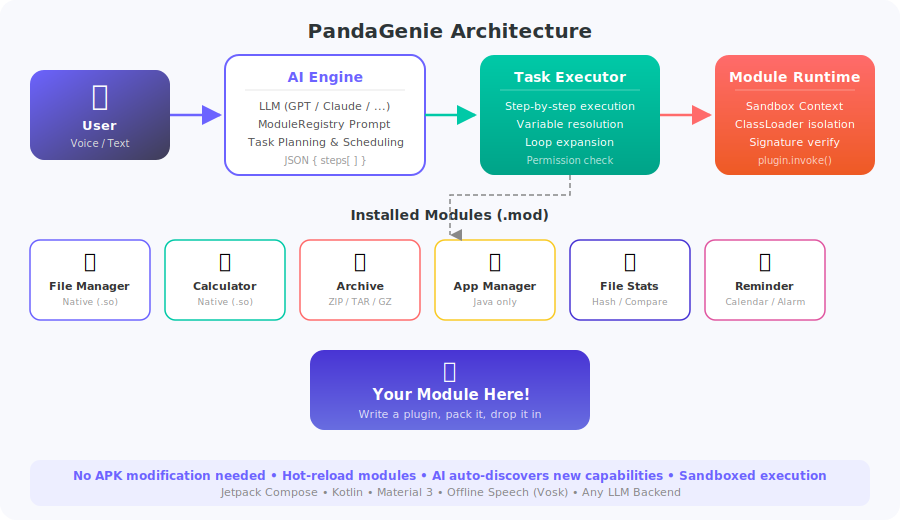
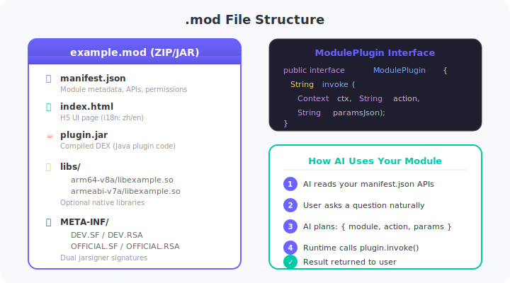
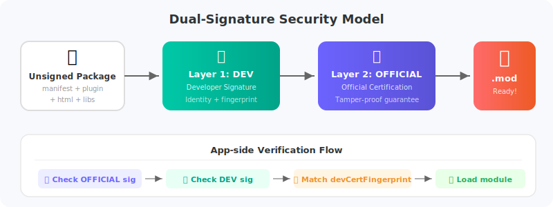

<div align="center">

<h1>&#x1F43C; PandaGenie</h1>

<p><strong>AI 驱动的模块化 Android 助手</strong></p>

<p>
用自然语言告诉 PandaGenie 你的需求，<br/>
它会自动规划、执行并返回结果 — 由<strong>任意大模型</strong>驱动，搭配持续增长的<strong>热加载模块库</strong>。
</p>

<p>
  <a href="#下载体验">下载体验</a> &nbsp;&#x2022;&nbsp;
  <a href="https://github.com/Rorschach123/PandaGenieModules">模块市场</a> &nbsp;&#x2022;&nbsp;
  <a href="#创建你的模块">创建模块</a> &nbsp;&#x2022;&nbsp;
  <a href="README.md">&#x1F1EC;&#x1F1E7; English</a>
</p>

</div>

---

## 为什么做 PandaGenie

生成式 AI 的爆发正在掀起一场新的互联网革命，它与 PC 互联网、移动互联网一脉相承 — 算力被量化为 Token，就像流量之于运营商。如果这是一次新的历史轮回，那 ChatGPT 的问世就是元年，之后将涌现大量基于 AI 的全新应用形态。

回到本质：计算机世界的一切操作，归根结底都是**计算**。用户要的是**结果**，不是过程。既然如此，AI 的价值就在于**串联所有环节** — 将用户的自然语言需求，直接转化为可执行的结果。

PandaGenie 正是从这个原点出发：**让智能手机变成真正的 AI 助理**，用户的任何需求都可以通过一个对话框完成。

### 设计原则

| 原则 | 说明 |
|------|------|
| **透明安全** | AI 执行的每一步操作、访问的每一项数据完全可见可控。模块代码开源透明，接受全网审计 |
| **低 Token 消耗** | Token 如同流量套餐，不是无限的。通过精确的 prompt 工程和任务规划，最大限度降低消耗 |
| **面向普通用户** | 用户只需知道"我要做什么"，不需要知道"点哪个按钮、走几步流程" |
| **连接开发者与用户** | 开发者构建模块，模块承载能力，AI 按用户指令调度执行 — 一种全新的开发者-用户协作模式 |

---

## 工作原理

> "把 /Download 里所有照片压缩成一个 zip" — 你只需要说这一句话。

PandaGenie 连接你选择的大模型（GPT、Claude、DeepSeek 或任何 OpenAI 兼容 API），读取所有已安装模块的能力描述，自动规划多步骤任务。不需要写代码，不需要在菜单里翻来翻去。

<p align="center">
  
</p>

**核心亮点：**

- **任意大模型后端** — OpenAI、Claude、DeepSeek、本地部署，或任何兼容 API
- **热加载模块** — 放入 `.mod` 文件，重启 APP 即生效，无需重新编译 APK
- **AI 自动发现能力** — 新模块的 API 自动注入 AI 提示词
- **沙箱执行** — 文件访问、网络、权限按模块独立管控
- **离线语音** — 内置 Vosk 语音识别，无需联网
- **双重签名安全** — 防篡改模块验证机制

---

## 架构设计

PandaGenie 将 **AI 大脑** 与 **模块生态** 完全解耦：

```
用户  ──>  AI 引擎  ──>  任务执行器  ──>  模块运行时  ──>  Plugin.invoke()
             │                │                 │
        从模块构建提示词     逐步执行          沙箱 + 签名验证
                          变量解析           独立 ClassLoader
```

APP **不硬编码**任何模块信息。所有能力均由模块的 `manifest.json` 声明，运行时动态注入 AI 系统提示词。

---

## 模块系统

每个 `.mod` 文件是一个自包含的模块包：

<p align="center">
  
</p>

模块只需实现**一个接口**：

```java
public interface ModulePlugin {
    String invoke(Context context, String action, String paramsJson) throws Exception;
}
```

AI 读取你的 `manifest.json`，理解模块能做什么，然后自动调用 `invoke()` 并传入正确的 `action` 和参数。

---

## 安全机制：双重签名

每个 `.mod` 携带两层 JAR 签名，确保分发安全：

<p align="center">
  
</p>

| 签名层 | 用途 |
|--------|------|
| **DEV**（开发者） | 标识模块作者身份，指纹绑定到 manifest |
| **OFFICIAL**（官方） | 证明模块通过官方审核，使用 APP 内嵌证书验证 |

开发者模式下允许加载仅有 DEV 签名的模块，方便测试。

---

## 已有模块

| 模块 | 功能描述 | 类型 |
|------|---------|------|
| &#x1F4C1; **文件管理器** | 浏览、创建、复制、移动、删除、搜索文件 | 原生 |
| &#x1F9EE; **计算器** | 科学计算：表达式、三角函数、对数、阶乘 | 原生 |
| &#x1F4E6; **压缩解压** | ZIP（支持密码）、TAR、GZ 压缩解压 | 原生 |
| &#x1F4F1; **应用管理** | 查看、启动、卸载应用，查看应用详情 | Java |
| &#x1F4CA; **文件统计** | 哈希计算、文件对比、目录统计、重复文件查找 | Java |
| &#x23F0; **提醒助手** | 日历事件、闹钟、倒计时、生日提醒 | Java |
| &#x1F50F; **签名校验** | 验证 APK 和模块签名信息 | Java |

> **想要更多模块？** 那就靠**你**了！

---

## 下载体验

<!-- TODO: 添加下载链接 -->
> &#x1F4E5; **APK 下载**：*即将发布*

---

## 创建你的模块

开发 PandaGenie 模块**超级简单** — 特别适合用 AI 编程助手（如 Cursor）进行 vibe coding。

### 只需 3 个文件

```
source/my_module/
├── manifest.json      ← 告诉 AI 你能做什么
├── index.html         ← 可选的 UI 页面
└── plugin_src/
    └── .../MyPlugin.java   ← 你的逻辑
```

### 快速示例

**manifest.json** — 描述你的 API：

```json
{
  "id": "my_module",
  "name": "我的模块",
  "name_en": "My Module",
  "description": "做一些很酷的事情",
  "description_en": "Does something cool",
  "version": "1.0",
  "apis": [
    {
      "name": "doSomething",
      "desc": "执行操作",
      "desc_en": "Does the thing",
      "params": ["input"],
      "paramDesc": ["输入内容"],
      "paramDesc_en": ["The input"]
    }
  ]
}
```

**MyPlugin.java** — 实现一个方法：

```java
public class MyPlugin implements ModulePlugin {
    @Override
    public String invoke(Context ctx, String action, String params) throws Exception {
        JSONObject p = new JSONObject(params);
        if ("doSomething".equals(action)) {
            return new JSONObject()
                .put("success", true)
                .put("output", "完成: " + p.optString("input"))
                .toString();
        }
        return new JSONObject().put("success", false).put("error", "Unknown action").toString();
    }
}
```

### 构建与部署

```powershell
# 在 PandaGenieModules/module-dev-toolkit/ 下
.\mk_module.ps1 -Action init-dev-signing    # 仅首次需要
.\mk_module.ps1 -Action pack -Modules "my_module"

adb push ..\modules\my_module.mod /sdcard/PandaGenie/modules/
```

完整开发指南请参考 [PandaGenieModules/module-dev-toolkit/MODULE_DEVELOPMENT_GUIDE.md](https://github.com/Rorschach123/PandaGenieModules/blob/main/module-dev-toolkit/MODULE_DEVELOPMENT_GUIDE.md)。

---

## 项目结构

本项目分为三个仓库：

| 仓库 | 用途 |
|------|------|
| **[PandaGenieSource](.)** （本仓库） | 模块源代码和构建工具 |
| **[PandaGenieModules](https://github.com/Rorschach123/PandaGenieModules)** | 编译后的 `.mod` 文件、模块市场索引、开发者工具包 |
| **[PandaGenieServer](https://github.com/Rorschach123/PandaGenieServer)** | 后端 API：多 LLM 代理、模块市场、签名服务 |

```
PandaGenieSource/
├── source/                    # 模块源码
│   ├── shared_api/            # ModulePlugin 接口
│   ├── calculator/
│   ├── filemanager/
│   ├── archive/
│   ├── app_manager/
│   ├── file_stats/
│   ├── reminder/
│   └── signature_checker/
└── tools/
    ├── pack_modules.ps1       # 打包签名 .mod 文件
    └── build_all_native.ps1   # 编译原生库
```

---

## 参与贡献

PandaGenie 是一个**共创平台** — 除了作者提供的官方模块，我们真诚地期待更多开发者加入，共建更丰富的模块生态。

最棒的是，你完全可以用 **vibe coding** 的方式完成开发 — 向 Cursor 等 AI 编程助手描述你想要的功能，它就能帮你生成完整的模块代码。整个项目本身就是这样构建的。

### 贡献流程

1. **Fork** 本仓库
2. 在 `source/<your_module_id>/` 下创建你的模块
3. 在 APP 中开启开发者模式测试
4. **提交 Pull Request** — 审核通过后由官方签名发布

### 共创要求

- **代码透明开放** — 所有模块代码公开可审计，保证模块行为可信
- **保管好开发者签名** — 先对模块进行开发者签名，提交审核后由官方签名发布
- API 描述清晰准确（AI 会读取它来理解能力！）
- 支持中英双语（`_en` 后缀字段）
- 最小权限原则 — 只申请必要的权限

### 模块灵感

- &#x1F3A8; **图片工具** — 缩放、格式转换、加水印
- &#x1F4DD; **笔记助手** — 创建和搜索笔记
- &#x1F4E7; **短信管理** — 搜索、导出短信
- &#x1F4F6; **网络工具** — Ping、DNS 查询、测速
- &#x1F50B; **电池管理** — 电量统计、优化建议
- &#x1F3B5; **音频工具** — 元数据编辑、格式转换
- &#x1F4CB; **剪贴板管理** — 历史记录、模板
- &#x1F4CD; **位置工具** — 附近地点、坐标转换
- ...以及任何你能想到的功能！

---

## 技术栈

| 组件 | 技术 |
|------|------|
| APP | Kotlin、Jetpack Compose、Material 3 |
| AI | 任意 OpenAI 兼容 / Claude API |
| 语音 | Vosk（离线识别） |
| 模块 | Java 插件、DEX ClassLoader、可选 JNI/C++ |
| 签名 | PKCS12 密钥库、jarsigner、DPAPI |
| 构建 | PowerShell、Android SDK（d8、javac） |

---

## 开源协议

本项目采用 LGPL-3.0 协议开源。详见 [LICENSE](LICENSE)。

---

<div align="center">

**Built with &#x2764;&#xFE0F; and a lot of vibe coding**

*PandaGenie — 让 AI 帮你处理手机上的琐事*

</div>
